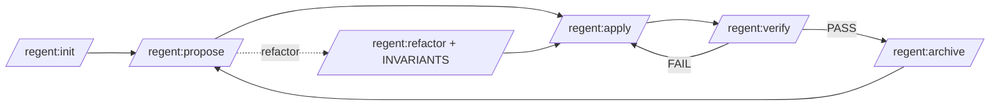

# Regent — framework SDD dla Claude Code

> Plugin Claude Code: zestaw skilli, agentów i szablonów, które zamieniają Claude Code w **ustrukturyzowanego
> partnera inżynierskiego**. Praca z projektami odbywa się metodą **SDD (Spec-Driven Development)**
> + **TDD**: najpierw specyfikacja, potem testy, potem kod, na końcu weryfikacja i archiwizacja.

Framework wymusza powtarzalny, kontrolowany proces zmian: każda funkcjonalność przechodzi
przez ten sam cykl, każdy krok ma dedykowanego agenta z dobranym modelem, a dokumentacja
projektu (`ai/docs/`) jest jedynym źródłem prawdy dla AI.

---

## Spis treści

- [Dla kogo](#dla-kogo)
- [Filozofia](#filozofia)
- [Wymagania](#wymagania)
- [Użycie](#użycie)
- [Struktura repo](#struktura-repo)
- [Szybki start](#szybki-start)
- [Która komenda kiedy](#która-komenda-kiedy)
- [Przepływ pracy](#przepływ-pracy)
- [Komendy](#komendy)
- [Agenci i modele](#agenci-i-modele)
- [Szablony](#szablony)
- [Observability (opcjonalnie)](#observability-opcjonalnie)
- [Konwencje](#konwencje)
- [Bezpieczeństwo danych](#bezpieczeństwo-danych)
- [Dokumentacja rozszerzona](#dokumentacja-rozszerzona)

---

## Dla kogo

Dla zespołów i osób, które chcą pracować z AI nad realnym kodem **w sposób przewidywalny**:
bez „vibe codingu”, ze specyfikacją jako kontraktem, z testami przed kodem i z weryfikacją
przed mergem. Framework jest **agnostyczny wobec stacku** i obsługuje projekty **full-stack**
(backend + frontend) — konkretne realia projektu (framework backendu, framework UI, wzorce)
opisuje `/regent:init` w `ai/docs/`, a komendy/agenci z nich korzystają.

## Filozofia

1. **Spec przed kodem** — `/regent:propose` tworzy delta-specyfikację (ADDED/MODIFIED/REMOVED/INVARIANTS)
   z kryteriami akceptacji w Given-When-Then. Zły spec = zły kontrakt, więc spec się kwestionuje.
2. **TDD** — `/regent:apply` implementuje w cyklu 🔴 Red → 🟢 Green → 🔵 Refactor. Refactor jest obowiązkowy.
3. **Agent jako współodpowiedzialny partner** — kwestionuje złe decyzje, ostrzega przed ryzykiem,
   nie rozszerza zakresu (patrz `context/role.md`).
4. **Weryfikacja przed zamknięciem** — `/regent:verify` to 9-etapowa kontrola (testy, zgodność ze specem,
   code review, weryfikacja testów, DB, security, gotowość repo do wydania) + warunkowo observability;
   wynik utrwalany w `verification.md` (bramka dla `/regent:archive`).
5. **Oszczędność tokenów** — agenci czytają dokumentację **bezpośrednio** (Read), nie skanują `src/`;
   testy w pętli TDD uruchamiane **wąsko** (moduł/pattern), pełny `make check` tylko w bramkach.
6. **Liczy skrypt, nie model** — format delty, pokrycie AC przez taski, kolizje numerów REQ,
   utrata AC przy merge i dryf kodu sprawdza deterministycznie `scripts/sdd-check.sh`
   ([docs/sdd-check.md](docs/sdd-check.md)); model ocenia to, czego skrypt nie policzy.

## Wymagania

- [Claude Code](https://docs.anthropic.com/claude-code) z obsługą pluginów (skille, subagenci, hooki).
- Opcjonalnie `make` w projektach docelowych (generowany przez `/regent:init`).

## Użycie

Regent jest **pluginem Claude Code** — instaluje się z GitHuba na każdej maszynie, a skille
i agenci dostają prefiks `regent:` (`/regent:propose`, `regent:architect`).

```text
/plugin marketplace add DanielDrzazga/regent
/plugin install regent@regent
```

Plugin nie ma pola `version`, więc śledzi commity `main` — aktualizacja: `/plugin marketplace update regent`.
Do pracy nad samym pluginem: `claude --plugin-dir <klon repo>` ładuje go wprost z katalogu.
Skille wołają skrypty przez `${CLAUDE_PLUGIN_ROOT}/scripts/…` — Claude Code podstawia katalog
pluginu w treści skilli i agentów.

Po instalacji wpisz `/regent:` i Tab — lista pokazuje cały framework.

## Struktura repo

```
regent/
├── .claude-plugin/        # plugin.json (manifest) + marketplace.json
├── context/               # sdd.md (reguły SDD + mapa skilli), role.md (rola partnera)
├── agents/                # 9 subagentów (każdy z polem model:)
│   ├── architect.md              (opus)
│   ├── spec-writer.md            (sonnet)
│   ├── backend-dev.md            (sonnet)
│   ├── frontend-dev.md           (sonnet)
│   ├── code-reviewer.md          (opus)
│   ├── qa-engineer.md            (sonnet)
│   ├── dba.md                    (sonnet)
│   ├── security-auditor.md       (opus)
│   └── logging-engineer.md       (sonnet)
├── skills/                # 18 skilli (/regent:propose, /regent:apply, ..., /regent:archive)
├── templates/             # Szablony artefaktów zmian + Makefile
│   └── docs/              # Szablony plików ai/docs/ (wypełniane przez /regent:init)
├── scripts/               # sdd-check.sh (walidacja artefaktów), framework-lint.sh, statusline.sh, session-tokens.sh
├── docs/                  # Dokumentacja frameworka, wizja Regenta, plany zmian
├── .claude/               # reguły pracy nad tym repo (nie są częścią pluginu)
└── README.md · CONTRIBUTING.md
```

`context/` nie jest ładowany automatycznie — plugin nie wczytuje `CLAUDE.md`. Wstrzykiwanie
`context/sdd.md` (tylko w projektach z `ai/docs/`) i `context/role.md` przez hook SessionStart
dochodzi w zmianie `plugin-hooks` (`docs/plans/`).

## Szybki start

```text
1. /regent:init                     # wykryj stack i wygeneruj ai/docs/ (+ Makefile)
2. /regent:propose user-registration  # spec: proposal, specs (delta), design, tasks
3. /regent:apply user-registration    # TDD: Red → Green → Refactor, atomic commits
4. /regent:verify user-registration   # 9-etapowa weryfikacja
5. /regent:archive user-registration  # merge delta → ai/specs/, retrospektywa, archiwum
```

Pomocniczo: `/regent:status` (stan projektu), `/regent:explore` (analiza read-only), `/regent:logging`
(instrumentacja logami), `/regent:commit` (atomic commity), `/regent:testing`, `/regent:code-review`.

## Która komenda kiedy

| Sytuacja | Komenda |
|----------|---------|
| Pierwszy raz w projekcie | `/regent:init` |
| Nie wiem, czy i jak to zrobić — chcę zbadać opcje | `/regent:explore` |
| Nowy produkt albo duża inicjatywa — co budujemy i w jakich zmianach | `/regent:explore --discovery` |
| Nowa funkcjonalność albo zmiana zachowania | `/regent:propose` → `/regent:apply` → `/regent:verify` → `/regent:archive` |
| Zmiana struktury kodu bez zmiany zachowania | `/regent:refactor` |
| Coś nie działa i nie wiem dlaczego | `/regent:debugging` |
| Bug w dev/staging | `/regent:bugfix` |
| Krytyczny bug na produkcji | `/regent:hotfix` |
| Wracam po przerwie — gdzie jestem? | `/regent:status` |
| Testy do istniejącego kodu | `/regent:testing` |
| Review zmian (np. cudzego MR) | `/regent:code-review` |
| Logi w istniejącym kodzie | `/regent:logging` |
| Aktualizacja zależności / security patch | `/regent:dependency-update` |
| Zmienia się podejście, stack albo konwencja projektu | `/regent:revise` |
| Wiedza biznesowa: po co system istnieje | `/regent:wiki` |

## Przepływ pracy



Skróty poza pełnym cyklem:

- **`/regent:bugfix`** — bug w dev/staging (reprodukcja → failing test → minimalny fix → regresja);
  zamknięcie przez `/regent:archive`.
- **`/regent:hotfix`** — krytyczny bug na produkcji (max 30 min, max 3 pliki, plan rollbacku),
  follow-up przez `/regent:bugfix`.
- **`/regent:refactor`** — zmiana bez zmiany zachowania, zawsze z sekcją INVARIANTS w delta spec,
  przez pełny cykl (to nie skrót).

## Komendy

| Komenda | Rola |
|---------|------|
| `/regent:init` | Inicjalizacja `ai/docs/` (stack, wzorce, konwencje) + Makefile |
| `/regent:propose` | Spec przed kodem (proposal, specs, design, tasks) |
| `/regent:apply` | Implementacja TDD (Red → Green → Refactor) |
| `/regent:verify` | 9-etapowa weryfikacja (etapy 5-8 warunkowe) |
| `/regent:archive` | Merge delta specs → main, przeniesienie do archiwum (`--abandon` — porzucenie zmiany) |
| `/regent:bugfix` | Naprawa buga w dev/staging (z testem regresji) |
| `/regent:hotfix` | Krytyczny fix na produkcji (max 30 min, 3 pliki) |
| `/regent:refactor` | Refactoring bez zmiany zachowania (INVARIANTS) |
| `/regent:revise` | Aktualizacja `ai/docs/` gdy podejście się zmienia |
| `/regent:logging` | Instrumentacja kodu logami wg `logging-patterns.md` |
| `/regent:testing` | Pisanie i weryfikacja testów |
| `/regent:code-review` | Peer review zmian |
| `/regent:commit` | Atomic commity wg git-workflow (jedna linia, max 100 znaków) |
| `/regent:debugging` | Systematyczna diagnoza (fix przez `/regent:bugfix`) |
| `/regent:dependency-update` | Aktualizacja zależności i security patches |
| `/regent:status` | Przegląd stanu projektu |
| `/regent:explore` | Analiza read-only bez commitów |
| `/regent:wiki` | Wiki biznesowa w Obsidian (`ai/wiki/`) — poza cyklem SDD |

Definicja każdego skilla: `skills/<nazwa>/SKILL.md`.

## Agenci i modele

Model dobrany do wagi zadania (koszt vs. wymagane rozumowanie):

| Agent | Model | Zastosowanie |
|-------|-------|--------------|
| `regent:architect` | **opus** | Architektura, ADR, design review |
| `regent:security-auditor` | **opus** | OWASP, przegląd bezpieczeństwa |
| `regent:code-reviewer` | **opus** | Review + zgodność AC↔kod↔test |
| `regent:spec-writer` | **sonnet** | Delta specs, proposals |
| `regent:backend-dev` | **sonnet** | Implementacja TDD — backend (taski `[BE]`) |
| `regent:frontend-dev` | **sonnet** | Implementacja TDD — UI (taski `[FE]`, wg `frontend-patterns.md`) |
| `regent:qa-engineer` | **sonnet** | Strategia i pisanie testów |
| `regent:dba` | **sonnet** | Schematy, migracje, optymalizacja |
| `regent:logging-engineer` | **sonnet** | Instrumentacja logami wg wzorca |

Definicja każdego agenta (rola, model, narzędzia, format raportu): `agents/<nazwa>.md`.
Agenci analityczni (`regent:code-reviewer`, `regent:security-auditor`) i `regent:architect` są
**read-only** (bez Edit/Write) — artefakty do akceptacji zwracają w raporcie, zapisuje sesja
główna. Agenci weryfikujący używają jednego słownika werdyktów: `PASS / WARN / BLOCK`.

## Szablony

- **Artefakty zmian** (`templates/`): `proposal-template.md`, `spec-template.md` (delta),
  `main-spec-template.md` (main spec — cel merge w `/regent:archive`), `design-template.md`,
  `adr-template.md`, `user-story-template.md`,
  `test-plan-template.md`, `Makefile.node.template` (inne stacki: `/regent:init` generuje Makefile
  ad hoc z tym samym zestawem celów).
- **Pliki `ai/docs/`** (`templates/docs/`): `technology`, `architecture`, `naming`, `code-style`,
  `git-workflow`, `di-patterns`, `testing-patterns`, `exception-patterns`, `logging-patterns`,
  `frontend-patterns` (gdy projekt ma frontend), `glossary` (słownik domeny — gdy projekt ma
  własne słownictwo) — wypełniane przez `/regent:init` konkretami wykrytymi w projekcie.

## Observability (opcjonalnie)

Jeśli projekt utrzymuje dashboardy/alerty (np. Kibana) w `ai/docs/observability/`, framework
pilnuje, by **zmiana logowanej `action` nie rozjechała się z dashboardem**:

- `/regent:logging` (Krok 4.5) i `regent:logging-engineer` sygnalizują zmianę `action`/`type`/`module`.
- `/regent:verify` (Etap 7) uruchamia warunkową checklistę z `observability/maintenance.md`.

Framework **nie buduje** dashboardów — tylko wymusza refleksję. Brak `observability/` → kroki N/A.

## Konwencje

- **Commity:** `<type>: (<KEY>) <opis>` — **jedna linia, max 100 znaków, bez body**. Długi opis =
  commit za duży → rozbij na atomic. Nigdy `git add .`, nigdy commit bez testów, nigdy `--no-verify`.
- **Logi:** `action` w formacie `RZECZOWNIK_CZASOWNIK` (UPPERCASE, EN); tylko ID encji w `context`
  (zero PII/sekretów); nie logujemy w `domain/`.
- **Specyfikacje:** delta (nie pełny stan); każde AC testowalne; INVARIANTS obowiązkowe dla refactorów.
- **`ai/` jest osobisty:** każdy ma swój styl pracy z AI, więc `ai/` (docs, specs, changes, wiki)
  jest globalnie ignorowany (`/ai/` w `core.excludesfile` — `/regent:init` Krok 0.5) i nie trafia do
  repo produktu. Do MR idzie kod i testy, plan niesie opis MR z `/regent:verify`; numery REQ/AC są
  lokalne i nie trafiają do kodu.

## Bezpieczeństwo danych

Repo zawiera wyłącznie plugin, jego dokumentację i wizję Regenta — bez danych z `~/.claude`
(historia, transkrypty, sesje) i bez kodu ani danych z pracy etatowej (`.claude/rules/privacy.md`).

- Przed pushem sprawdź `git status` — `git add` tylko z listą konkretnych plików.
- Nigdy nie commituj sekretów ani realnych logów/payloadów.
- Dane, które plugin zapisuje w przyszłości (np. kronika), trafiają do `${CLAUDE_PLUGIN_DATA}`
  na danej maszynie, nie do repo.

## Dokumentacja rozszerzona

- [`docs/getting-started.md`](docs/getting-started.md) — pierwsze uruchomienie krok po kroku
- [`docs/workflow.md`](docs/workflow.md) — pełny cykl SDD + skróty
- [`docs/writing-docs.md`](docs/writing-docs.md) — `ai/docs/`, logowanie, observability
- [`CONTRIBUTING.md`](CONTRIBUTING.md) — jak dodać skill/agenta/szablon
- [`docs/vision.md`](docs/vision.md) — wizja Regenta
- [`docs/`](docs/README.md) — indeks całej dokumentacji (m.in. `statusline.md` — konfiguracja statusline)
