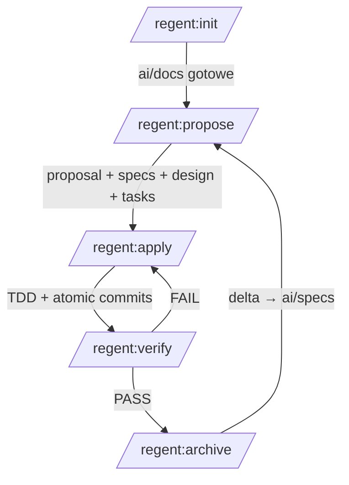

# Workflow SDD

Framework opiera się na jednym powtarzalnym cyklu dla każdej zmiany funkcjonalnej oraz na
kilku kontrolowanych skrótach dla przypadków szczególnych.

## Pełny cykl

### 1. `/regent:propose` — spec przed kodem

Tworzy `ai/changes/{nazwa}/`:

- `proposal.md` — problem, rozwiązanie, oczekiwany rezultat, zakres, wpływ oraz log
  `Decyzje i założenia` (rozstrzygnięcia z Challenge, założenia agenta, późniejsze AMEND).
- `specs/{domena}.md` — **delta**: `ADDED` / `MODIFIED` / `REMOVED` / `INVARIANTS`; jedyne miejsce
  AC (Given-When-Then, ID `REQ-NNN/AC-n` — w taskach, raportach i verification.md; do kodu nie trafia).
- `design.md` — podejście, warstwy, API, DB, observability, ryzyka.
- `tasks.md` — lista zadań (S/M/L).

Przebieg: wywiad (jedna runda) → Challenge (rundy pytań o decyzje; fakty agent ustala sam) →
`regent:spec-writer` (proposal + delta) → `regent:architect` (design) → `regent:spec-writer` (tasks po designie) →
kontrola spójności (Krok 2.5 + `sdd-check change/preflight`) → `Draft` do review →
`zatwierdzam` → `Approved`.

### 2. `/regent:apply` — TDD

Per task: 🔴 **Red** (failing test) → 🟢 **Green** (minimalny kod) → 🔵 **Refactor**
(obowiązkowy). Mocks-first (shared helpers wg `testing-patterns.md`). Implementuje agent
wg tagu taska w tasks.md: `[BE]`/bez tagu → `regent:backend-dev`, `[FE]` → `regent:frontend-dev`
(wg `frontend-patterns.md`), `[DB]` → `regent:dba`. Agent **sam uruchamia testy wąsko** w pętli
TDD; atomic commit per task robi sesja główna po raporcie z potwierdzonym GREEN. Test RED
sprawdza `weryfikację` z taska; powiązanie AC → test i hash commitu sesja zapisuje przy tasku
w lokalnym `tasks.md` (`ai/` jest osobisty i globalnie ignorowany).

**Zmiana kursu (Krok 4.5):** gdy kod ujawni, że plan się nie sprawdza, zmiana AC albo designu
idzie przez `AMEND` — decyzja użytkownika, wpis w `Decyzje i założenia`, poprawiona delta.
Dev nie zawęża AC po cichu: zgłasza `ZAKRES:` w `OPEN QUESTIONS`. Zmiana celu → nowa zmiana.

### 3. `/regent:verify` — 9 etapów (5-8 warunkowe)

| # | Etap | Agent |
|---|------|-------|
| 1 | Testy (lint, type-check, test, coverage) | sesja główna uruchamia `make …` |
| 2 | Spec Compliance (AC ↔ kod ↔ test) | `regent:code-reviewer` |
| 3 | Code Review | `regent:code-reviewer` |
| 4 | Test Verification | `regent:qa-engineer` |
| 5 | Database Review (jeśli dotyczy) | `regent:dba` |
| 6 | Security Review (jeśli dotyczy) | `regent:security-auditor` |
| 7 | Observability Sync (jeśli `ai/docs/observability/`) | sesja główna (refleksja, bez delegacji) |
| 8 | Smoke Check — happy path w uruchomionej apce (jeśli dotyczy) | sesja główna |
| 9 | Git & Release Readiness | — |

Reguła: **AC bez testu = maksymalnie ⚠️ PARTIAL, nigdy ✅ PASS.**

Przed Etapami 2-4 sesja główna liczy fakty skryptem (`sdd-check change` i `diff`: usunięte
lub wyłączone testy, mniej asercji, pliki spoza Affected Files) i przekazuje je reviewerom.
`regent:code-reviewer` porównuje kod z `design.md` w obie strony — luki `missing` / `incomplete` /
`contradicts` / `unrequested`.

Wynik zapisywany do `ai/changes/{nazwa}/verification.md` (verdict + tabela etapów + commit
HEAD) — to bramka dla `/regent:archive`. FAIL → fix → re-run Etapu 1 + oblanych etapów.

### 4. `/regent:archive`

Merge delta → `ai/specs/{domena}.md` (aktualizacja tabeli History; nowy main spec wg
`main-spec-template.md`), przeniesienie do `ai/changes/archive/{YYYY-MM-DD}-{nazwa}/`.
Wymaga `verification.md` z `Verdict: PASS` (`--force` = jawna decyzja, wpis UNVERIFIED).
MODIFIED podmienia w main spec **cały blok** REQ, więc merge otaczają dwie kontrole skryptem:
`sdd-check preflight` przed (kolizje numerów, MODIFIED bez REQ, utrata AC) i `postmerge`
po (main spec bez formatu delty, AC zgodne z deltą). `drift` ostrzega, gdy pliki zmiany
ruszyły się po weryfikacji.

**Rezygnacja ze zmiany:** `--abandon` zamyka zmianę porzuconą (niedokończone taski są wtedy
powodem zamknięcia, nie blokadą). Delta **nie** jest mergowana — main specs opisują kod, który
istnieje — a wpis w History dostaje `ABANDONED` z powodem. To alternatywa dla `rm -rf`, które
gubi delta spec i ślad, że temat był podnoszony.

**Retrospektywa (Krok 3.5)** — jedno pytanie na podstawie artefaktów zmiany: `BEZ WNIOSKÓW`
albo wniosek z konkretnym działaniem (najczęściej `/regent:revise`). Wniosek trafia do tabeli
History, nie do osobnego pliku.

## Skróty

| Skrót | Kiedy | Ograniczenia |
|-------|-------|--------------|
| `/regent:bugfix` | Bug w dev/staging | Reprodukcja → failing test → minimalny fix → test regresji; zamknięcie przez `/regent:archive` |
| `/regent:hotfix` | Krytyczny bug na produkcji | Max 30 min, max 3 pliki; plan rollbacku; follow-up przez `/regent:bugfix` |
| `/regent:refactor` | Zmiana bez zmiany zachowania | **INVARIANTS obowiązkowe** (w delta spec), pełny cykl propose→archive — to nie skrót |

## Utrzymanie dokumentacji

- `/regent:status --drift` — audyt: commity ruszające pliki zarchiwizowanych zmian poza cyklem
  SDD (hotfix bez follow-upu, ręczna poprawka), czyli miejsca, gdzie main spec mógł przestać
  opisywać kod.
- `/regent:revise <plik>` — gdy implementacja ujawni zmianę podejścia, zaktualizuj `ai/docs/`
  (nie zmieniaj ich „po cichu” — inni agenci z nich czytają).
- `/regent:logging` — po dodaniu/zmianie logowanej `action` przy istniejącym `ai/docs/observability/`
  sprawdź `observability/maintenance.md` (Etap 7 w `/regent:verify`).
- `/regent:wiki` — **poza cyklem SDD**. Utrzymuje `ai/wiki/` (vault Obsidian): wiedzę biznesową
  o tym, *po co* system istnieje. Kod daje szkielet (encje, stany, aktorzy), znaczenie wnoszą
  źródła zewnętrzne przez `ingest` (notatki ze spotkań, maile, transkrypty). Czyta
  `ai/docs/domain/glossary.md` i `ai/specs/`, nie modyfikuje ich.

## Zasady przekrojowe

- Delegacja: komenda z przypisanym agentem uruchamia go jako **subagenta** (narzędzie Task) —
  model z `agents/*.md` działa tylko wtedy, nie „w miejscu" w głównej sesji.
  Pełne mapowanie komenda→subagent: `CLAUDE.md`.
- Subagent nie rozmawia z użytkownikiem — bramki akceptacji prowadzi sesja główna;
  artefakty do akceptacji subagent zwraca w raporcie (kontrakt w `CLAUDE.md`).
- Spec jest kontraktem — zły spec kwestionuj przed implementacją.
- Nie rozszerzaj zakresu ponad specyfikację (scope creep).
- Nie commituj bez testów — nawet w hotfixie.
- Oszczędzaj tokeny: Read zamiast skanowania `src/`; testy w pętli TDD wąsko
  (moduł/pattern), pełny `make check` tylko w bramkach.
